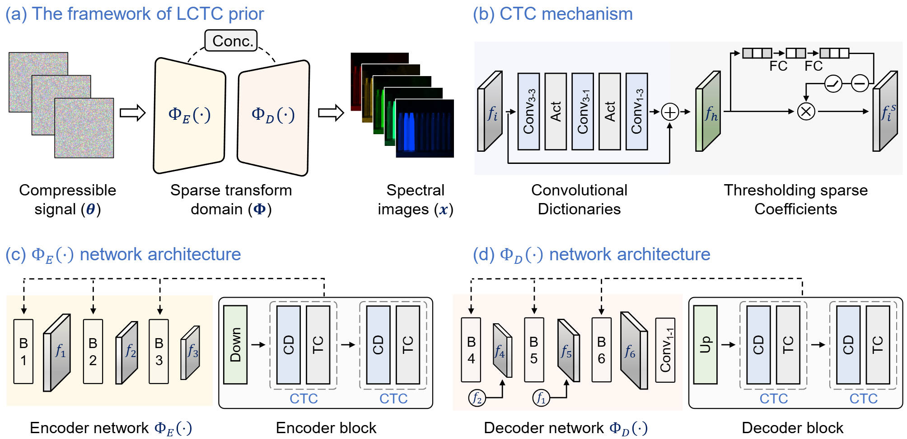

# LCTC: Lightweight Convolutional Thresholding Sparse Coding Network Prior for Computational Hyperspectral Imaging

This repository contains the official implementation of **LCTC (Lightweight Convolutional Thresholding Coding)**, a self-supervised hyperspectral image reconstruction framework that integrates **convolutional sparse coding** into an efficient deep prior for compressive hyperspectral imaging systems (e.g., CASSI, hyperspectral denoising, etc.).

<p align="center">
  
</p>

---

## 🔍 Overview

**LCTC** (Lightweight Convolutional Thresholding sparse Coding) is a novel *untrained neural network prior* designed for **compressive spectral imaging**. Inspired by convolutional sparse coding theory, LCTC treats the network as a *learnable sparse transform domain* and its input as the corresponding *sparse coefficients*. Unlike traditional model-based approaches that rely on handcrafted priors or deep learning methods that require large-scale training data, LCTC learns both the sparse domain and signal representation in a **self-supervised** manner directly from the compressed measurements.

LCTC can be deployed in two modes:

* **Standalone Prior:** Used independently for hyperspectral image reconstruction without external optimization.
* **PnP-LCTC:** Incorporated into iterative optimization frameworks (e.g., ADMM) as a **Plug-and-Play** regularizer to further boost reconstruction performance.

---

## ✨ Key Features

* **Model-Inspired Untrained Prior:** The LCTC network mimics convolutional sparse coding, providing an interpretable prior that bridges model-based and learning-based methods.

* **Self-Supervised Sparse Learning:** Both the transform domain and sparse coefficients are learned from a single measurement, eliminating the need for training datasets.

* **Lightweight & Efficient:** The network contains only \~0.24MB parameters and requires 4.7 GFLOPs, enabling fast inference and practical deployment in real-time or resource-limited settings.

* **Plug-and-Play Compatibility:** LCTC can be integrated into existing iterative solvers (e.g., ADMM) as a regularization prior, enhancing flexibility and performance.

* **Robust & High-Fidelity:** Outperforms existing untrained and model-based methods in terms of reconstruction accuracy, noise robustness, and generalization across different compressive spectral imaging systems.

* **Versatile Applicability:** Validated on both **snapshot compressive spectral imaging** (e.g., CASSI) and **line-scan hyperspectral imaging**, demonstrating strong adaptability to diverse imaging scenarios.

---

## 🧠 Network Architecture

The **LCTC** (Lightweight Convolutional Thresholding sparse Coding) network is a novel **untrained neural network prior** specifically designed for compressive spectral imaging (CSI). It blends model-based interpretability with the flexibility of deep learning by learning both the sparse transform domain and the compressible signal directly from encoded measurements—without any external training data.

### 🔧 Core Design: Convolutional Thresholding Sparse Coding (CTC)

At the heart of LCTC lies the **CTC module**, which simulates the sparse coding process by:

* **Convolutional dictionaries**: Three efficient convolutional layers (with kernel sizes 3×3, 3×1, and 1×3) extract meaningful features while minimizing computational load.
* **Nonlinear thresholding**: A learnable soft-thresholding mechanism selects important spectral features based on global pooling and fully connected layers, producing sparse activations.
* **Residual learning**: Residual connections enhance convergence and optimization efficiency.

These CTC modules transform feature maps into sparse representations and back, forming the basis of a learnable sparse transformation.

Despite its expressive capability, the LCTC network remains extremely compact:

* **Model size**: \~0.24MB
* **Computational cost**: 4.7 GFLOPs

This design enables fast and memory-efficient inference suitable for real-time or embedded spectral imaging applications.

---


Certainly! Based on the updated structure of your [LCTC repository](https://github.com/YurongChen1998/LCTC/tree/main), here's the revised **Directory Structure** and **Getting Started** sections for your `README.md`:

---

## 📁 Directory Structure

```bash
LCTC/
├── Data/                      # Scripts and utilities for data loading and preprocessing
├── LCTC_4FastLineScan/        # LCTC implementation for fast line-scan hyperspectral imaging (hyperspectral denoising)
├── LCTC_4SDCASSI/             # LCTC implementation for snapshot compressive spectral imaging (SD-CASSI)
└── README.md                  # Project overview and documentation
```

---

## 🚀 Getting Started

### 1. Clone the Repository

Begin by cloning the repository to your local machine:

```bash
git clone https://github.com/YurongChen1998/LCTC.git
cd LCTC
```

### 2. Prepare the Dataset

Download and preprocess the necessary datasets:

* **KAIST CASSI Dataset**: [Link](https://github.com/YurongChen1998/LCTC/tree/main/Data)]
* **CAVE Toy Dataset**: [Link](https://github.com/YurongChen1998/LCTC/tree/main/Data))

Ensure that the datasets are organized as per the instructions provided in the `Data/` directory or the respective subdirectories.

### 3. Run LCTC

Navigate to the appropriate subdirectory based on your application:

* For **fast line-scan hyperspectral imaging (Hyperspectral denoising)**:

  ```bash
  cd LCTC_4FastLineScan
  python main.py
  ```

* For **snapshot compressive spectral imaging (SD-CASSI)**:

  ```bash
  cd LCTC_4SDCASSI
  python main.py
  ```

---

## 📊 Evaluation Metrics

We report standard hyperspectral reconstruction metrics:

* PSNR (Peak Signal-to-Noise Ratio)
* SSIM (Structural Similarity Index)
* SAM (Spectral Angle Mapper)

Evaluation metric can be reproduced using [provided scripts](https://github.com/YurongChen1998/LCTC/tree/main/Data/Test_results_metric).

---

## 📬 Contact

For questions, please contact:

* 陈煜嵘 (Yurong Chen) 
* Hunan University
* Email: chenyurong1998@outlook.com
* 🤝🤝🤝

---
